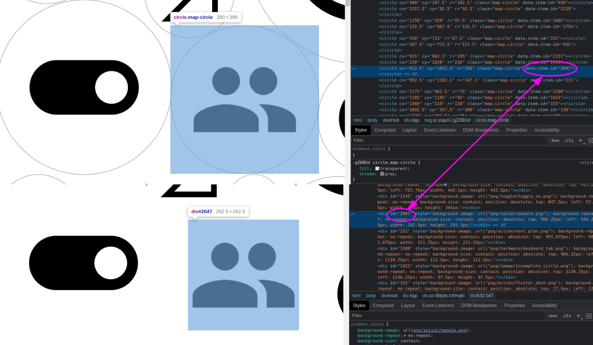

# Map generation process

## Requirements

### How it all works?

In the demo frontend application we use a library called [OpenSeaDragon](http://openseadragon.github.io/) to give us this map-like functionality so our huge map of things can be observed by using gestures like zoom or pan. It uses a special format DZI (Deep Zoom Image) which we have to generate first, and also to make the clicking and filtering possible for the items we also need a special kind of SVG overlay that contains the information about each item’s location on the map and their IDs.

This documentation will introduce how to create the assets needed for this feature.

### Required tools

- To generate the full map of images as a big JPG file, and to generate the SVG overlay, use the generator features (Tile Editor + Mag Generator) of the demo app by navigating to them via the menu. To generate your own map you have to run the React application locally and provide the necessary files (images) and information. From there you can export the map and the overlay with a few clicks.

- To convert the JPG map into the above mentioned DZI format, you have to use some 3rd party tool. An example I will use in this documentation is [VIPS](https://www.libvips.org/), but there are many other options too listed in the [OpenSeaDragon documentation](http://openseadragon.github.io/examples/creating-zooming-images/).

## Generating the map

For the followings you need to run the application locally so open the project in your favorite editor and run

```shell
npm ci
npm start
```

### Images for the map

First, we need to have all the images (preferably as PNG files) in the project `public/png` folder. We also need a file list that contains all the necessary information. The data we need for each image is the ID of the image (for filtering and click interactions), and the filename (to identify and load the image).The objects in that list might contain other information as well, but that is the minimum we need.

```javascript
export const fileList: FileData[] = [
  { id: 1, filename: 'png/action/123.png', name: '123', category: 0 },
  { id: 2, filename: 'png/action/3d_rotation.png', name: '3d_rotation', category: 0 },
  // ...
  ];
```

By default, you should generate this file to the `src/Data/fileList.ts` location.

## Setting up the tiles

The map itself is not based on some randomized positioning, but for simplicity it is built using so-called “tiles”, where each tile contains several images with different sizes, and these tiles are placed in rows and columns next to each other to create the “big map” of items.

The currently used tile looks like this:


### Tile editing
In case you need to update the tiles themselves, make sure you get a nice square image with the properly distributed circles from a designer. The app has a “tile editing page” which can be accessed from the menu or by going to the `/tile-editor` route.

The point here is to place the “ideal” image under the SVG element and then using your browser’s dev tools adjust each circle’s `cx, cy` and `r` attributes to match the image as much as possible.


Once you are done in the dev tools, just click the Get circle positions button and you’ll get each value, which then you can copy into the code:


Just overwrite these lines in the `src/Utils/generator.variables.ts` with the new values:
```javascript
export const TILE: Circle[] = [
  // cx, cy, r of each circle in a tile
  [44, 44, 44],
  [177, 143, 120],
  [30, 117, 30],
  [30, 186, 30],
  // ...
  ];
```

## Layout of the tiles and sizing

Once the basic tile config is done, we can go to the map generator page. The logic is implemented in the `src/Pages/Generator/index.tsx` component, you might need to edit this file as well to achieve the expected results. You'll find hopefully useful comments in the code to understand what's happening.

In the `src/Utils/generator.variables.ts` file you’ll find some constants which are responsible of adjusting the layout of the map and its basic sizing. Just follow the comments in the code to see what is what.

The default values set for these variables are covering the current number of icons and provide a base value of sizing that makes sure most of the images will fit inside their circles.

Although there can be some cases when an image is still too big (its edges are outside of the circle - which is a bigger problem) or maybe too small.

To check this you can turn on the display of the circles on the menu in the top-left corner using the Toggle circle strokes button.


In this case it is possible to set a unique multiplier value for each image you feel it’s necessary in the `src/Data/multipliers.ts` file:
```javascript
/**
 * Unique multipliers can be set for each image if they are too big (or too small)
 * The key is the ID of the image, the value is the multiplier
 */
export const multipliers: Record<number, number> = {
  992: 0.9,
  518: 0.95,
}
```

> **Note:** To make it easier to identify an image, you can disable the whole SVG layer using the Toggle SVG layer button on the menu, so when you right-click and inspect an image it will select the img element and not the SVG circle.

## Exporting the JPG and SVG files

To check if everything is correct and ready for exporting, you can use your developer tools and confirm that an SVG circle and the underlying PNG image has the same identifier:


To export the required files you can use the menu in the top-left corner:

### Exporting the image map

There are two ways to export the big image map to a JPG file depending on the number of images and the size of the whole map. Since all the process is happening in the browser, over a certain size (about 1500 images) the browser can run out of memory, and it will not be able to export directly to JPG.

- **JPG mode**: This is the default mode, it works for smaller maps and will directly export your map to a JPG file. Simply click the "Export map to JPEG" button on the menu. Note: this is a very resource heavy operation, and it can take minutes. It’s recommended to close all other browser tabs and also close the developer tools before using it.
- **SVG mode**: Use this mode if your browser crashes when trying to export directly to JPG. Clicking the "Export map as SVG" menu button, it will download a simple SVG file, which you need to convert to JPG with some other tool outside this application, e.g. Gimp. Remember, to properly open the file it needs to be next to the png/ folder due to the relative links (i.e. project/public/)

### Exporting the SVG layer 

This will create an SVG file that has the same size (dimensions) as the map JPG and has all the circles with the identifiers in the right place.
:warning: Important: do not change the code or reload the page between these two steps. On each change/reload the map might be randomized and then the SVG and JPG will export a different state of the items.

If you'd like to use the demo application to check out your own map, you have to place this SVG overlay file here: `src/Components/ImageMap/map-circles.svg`

The JPG map is the one we need to convert to DZI format, which is what we’re gonna do next.

## Converting the JPG map to DZI format

As I mentioned, to convert the JPG map to DZI format a 3rd party tool is needed. There are many options listed in the [OpenSeaDragon documentation](http://openseadragon.github.io/examples/creating-zooming-images/) for each operating systems from GUI tools to web applications and command line interfaces.

I used the [VIPS CLI tool](https://www.libvips.org/) and it takes only one line of command to get what we want:

```shell
# in the folder where you saved the image map JPG file:
vips dzsave image-map.jpg ./dz-map
```
This will generate a `dz-map.dzi` file with some metadata and a `dz-map_files` folder that contains all the tiles for the zoomable image format.

Copy all of these into the public folder of the frontend application, and we’re almost done!

## Final touches

We have all the files we need in place to update the image map.

One more last thing to check is if the total size or the file name of the map has changed. If the newly created map is different, you’ll have to update the OpenSeaDragon options object in the `src/Components/ImageMap/index.tsx` file.

> If you haven't changed the name of the map files, it might need a cache clearing and/or some restarts for the browser to pick up the newly generated map correctly. This is because inside that `dz_files` folder the small images mostly have the same name as earlier but have different content.
